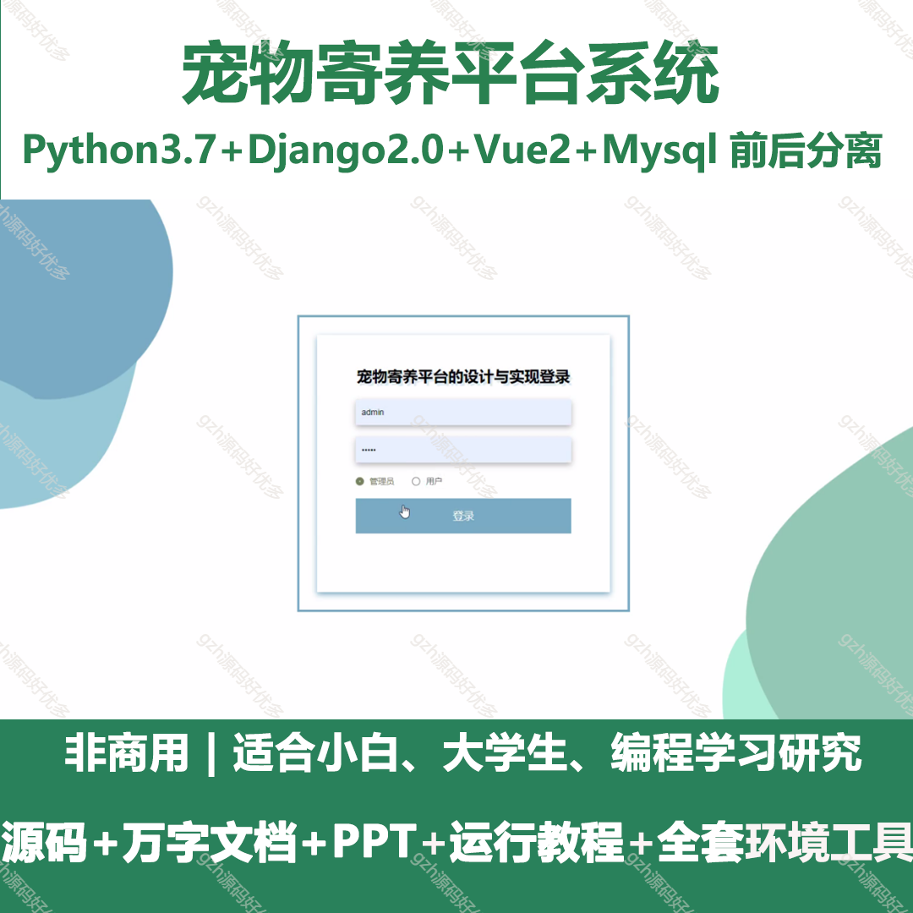
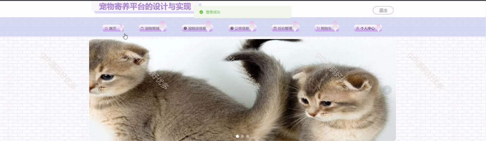
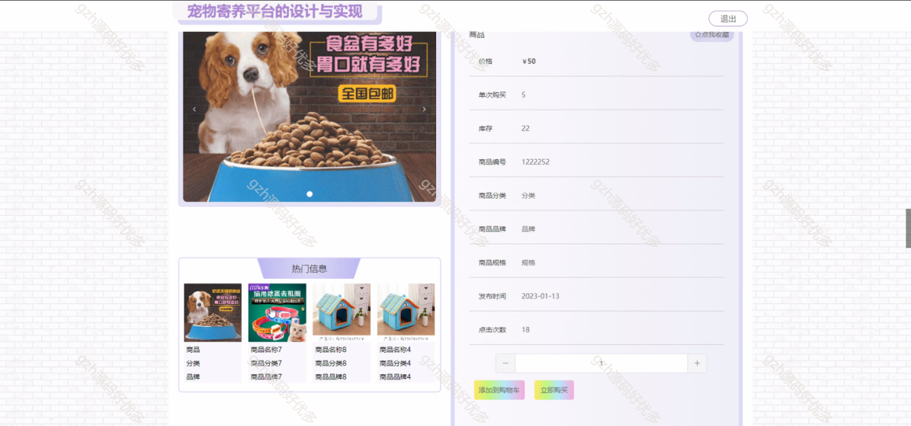
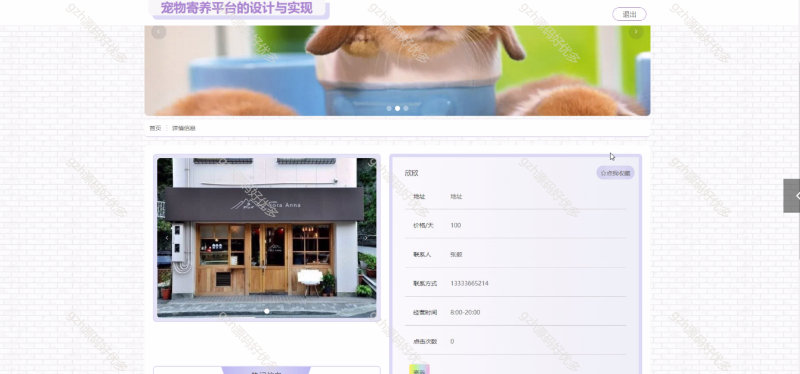
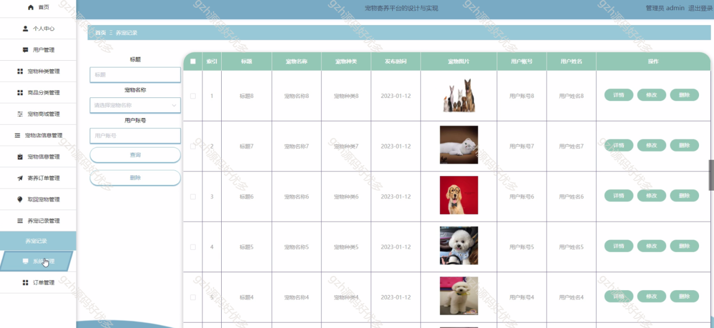
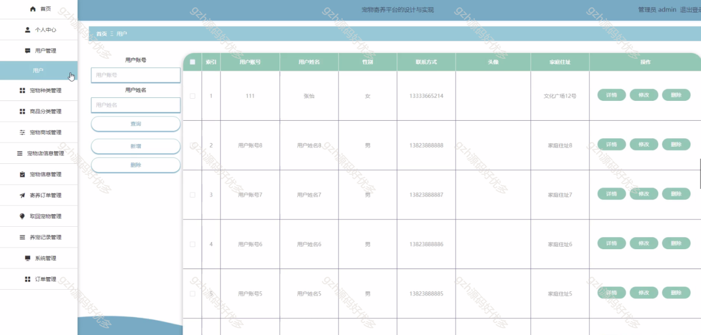
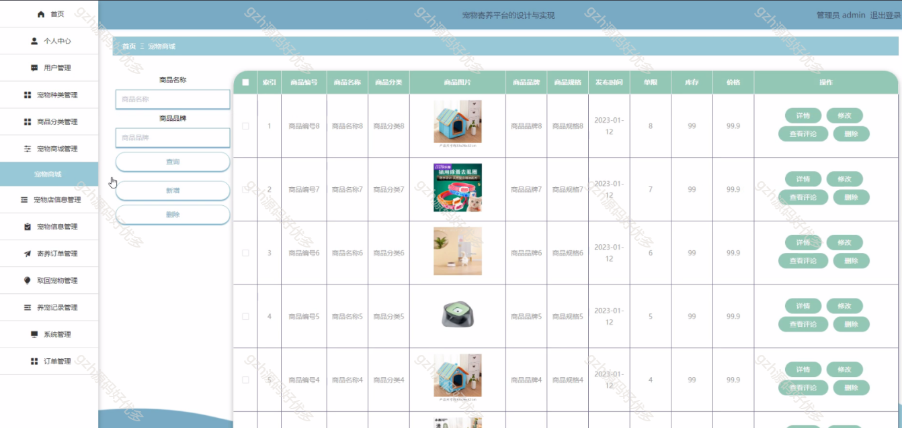
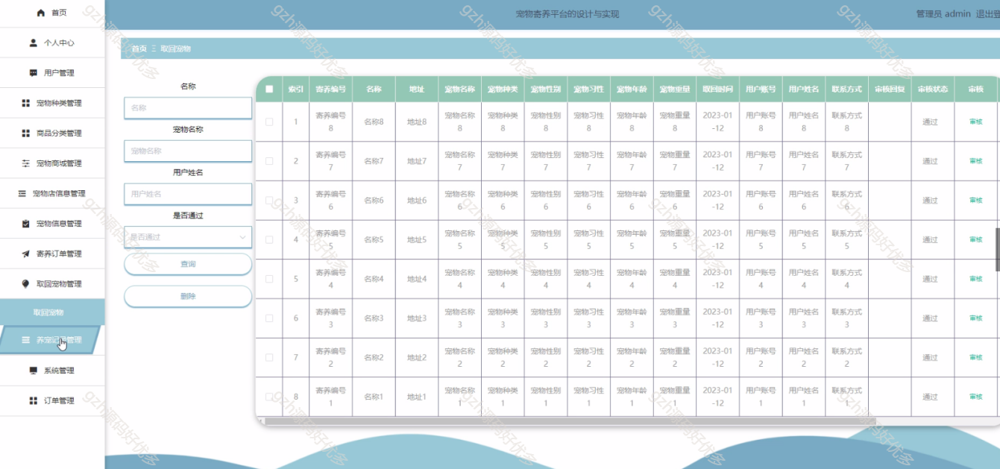
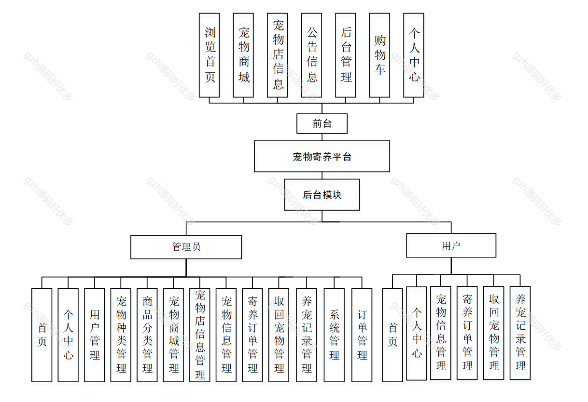
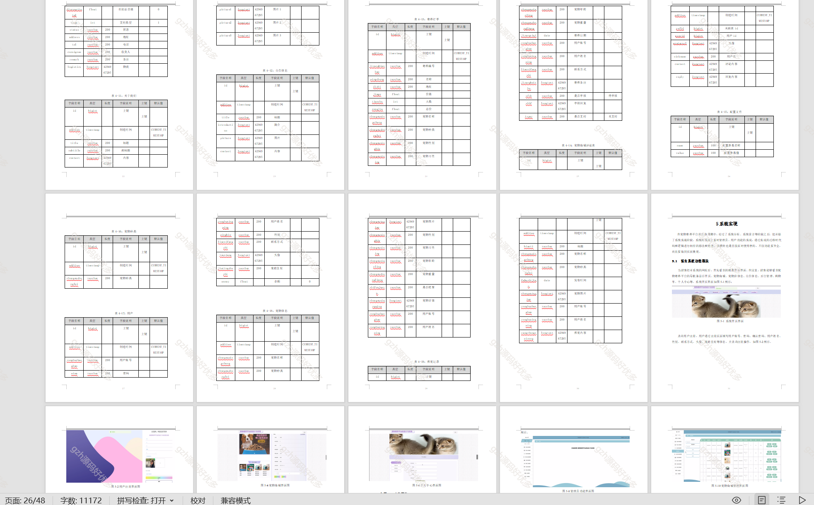

# python015
python015基于Django的宠物寄养平台系统
 
## 查看主页获取源码

### 一、关键词

宠物寄养平台,宠物管理系统

 

### 二、作品包含

源码+数据库+万字文档+PPT+全套环境和工具资源+部署教程

 

### 三、项目技术

前端技术：Html、Css、Js、Vue2.0、Element-ui
后端技术：Python3.7、Django2.0

  

 

### 四、运行环境（以下版本亲测，其他版本未知，请自测）

开发工具：PyCharm + VSCODE

数据库：MySQL5.7（最低要5.7版本）

数据库管理工具：Navicat10+

Python：Python3.7

前端Nodejs：14

浏览器：谷歌浏览器

 

### 五、项目介绍

项目编号：python015

宠物寄养平台展现了其蓬勃生命力和广阔的前景。与此同时，为解决用户需求，宠物寄养平台发展愈发多元化与网络化，与电子信息技术相结合。宠物寄养平台应运而生。

该宠物寄养平台，前台用户可浏览、购物、管理个人中心；后台管理员能进行用户、宠物及店铺信息、寄养订单等全面管理，用户也可操作宠物信息、寄养订单及养宠记录 。

 

### 六、运行截图

